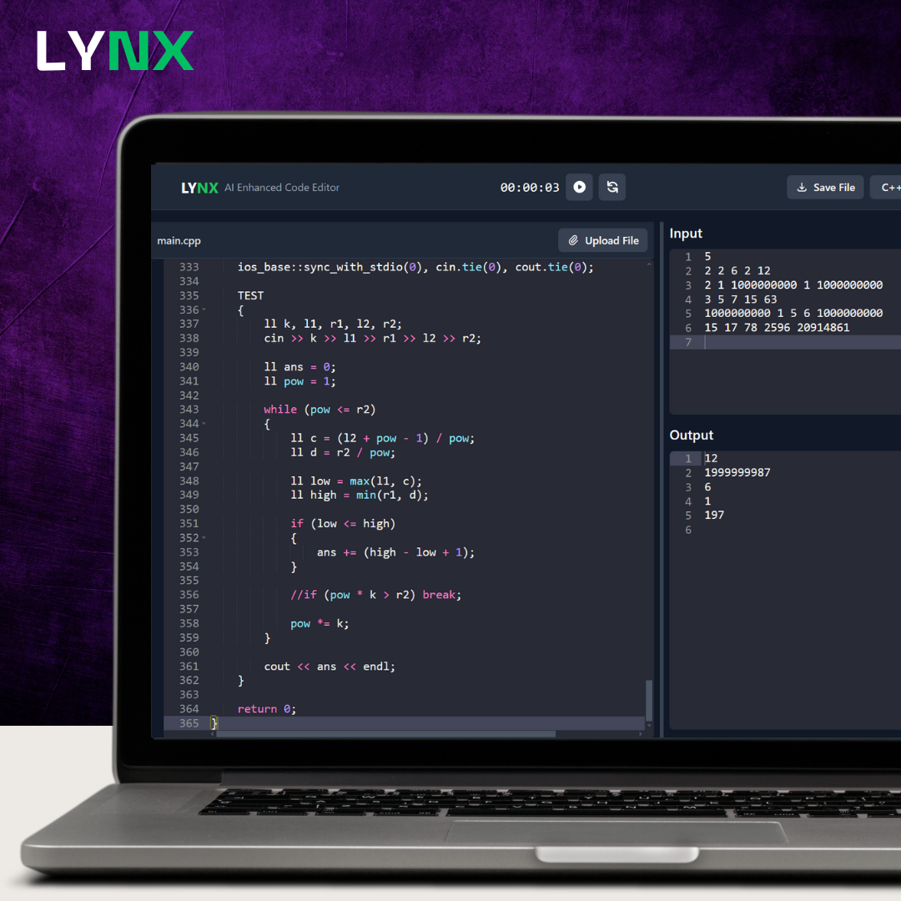
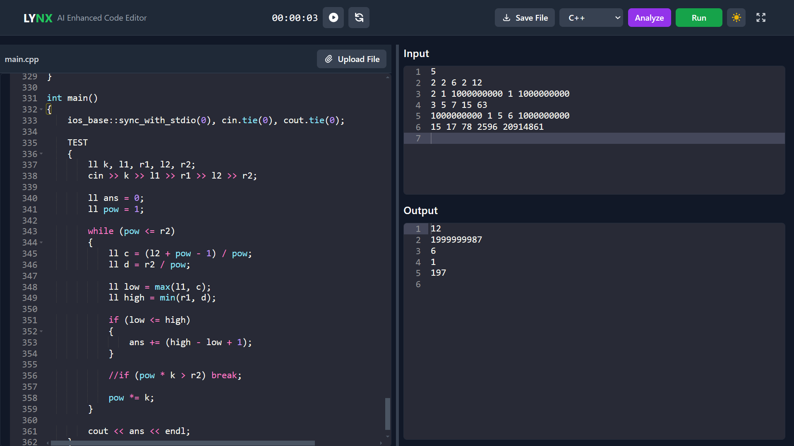
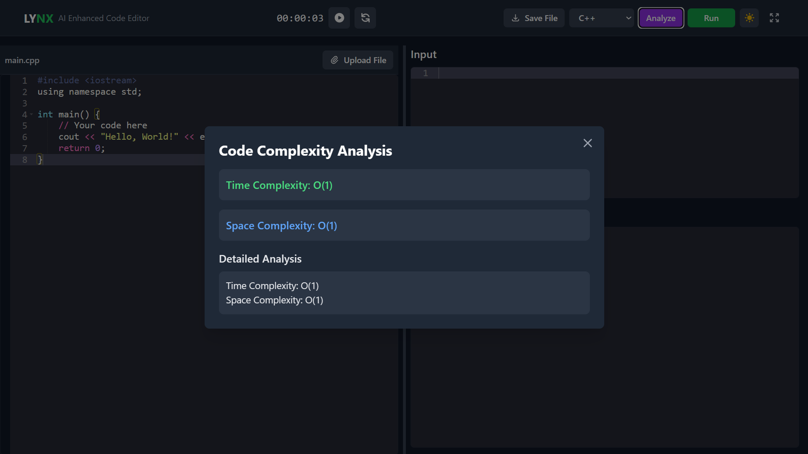
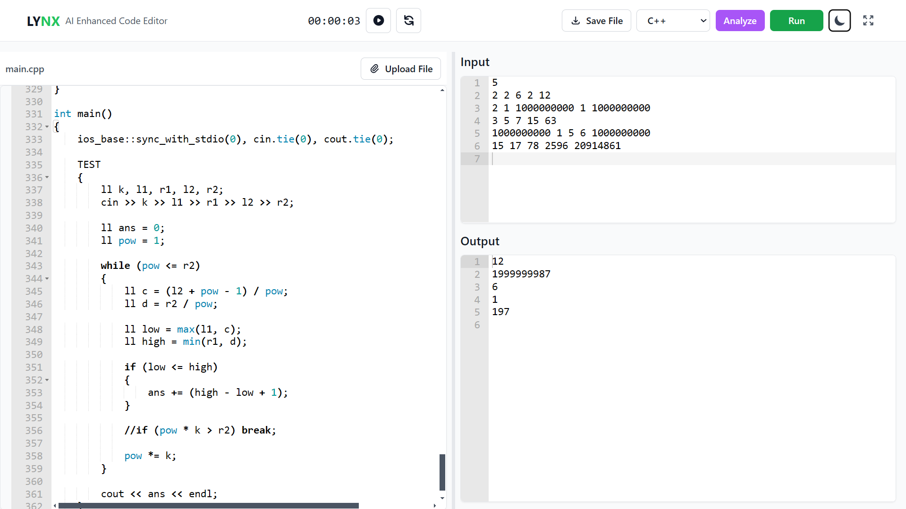

<div align="center">
  
</div>

# LYNX - Online Code Editor

LYNX is a modern, simple online code editor with AI analysis, designed to make coding more efficient and enjoyable.

## Features

### Code Editor


- Syntax highlighting
- Auto-completion
- Multiple language support (Python, JavaScript, C++, Java)
- Time Tracking

### AI Analysis


- Time complexity analysis
- Space complexity analysis

### Input/Output Console


- Interactive console
- Real-time output
- Error handling
- Input testing

### Installation

1. Clone the repository:

   ```bash
   git clone https://github.com/rijonshahariar/LYNX.git
   ```

2. Navigate to the project directory:

   ```bash
   cd LYNX
   ```

3. Install dependencies:

   ```bash
   npm install
   ```

5. Start the development server:

   ```bash
   npm run dev
   ```

### Usage

After installation, open your browser and navigate to `http://localhost:5173/` to access the application.

### License

This project is licensed under the MIT License. See the [LICENSE](LICENSE) file for details.